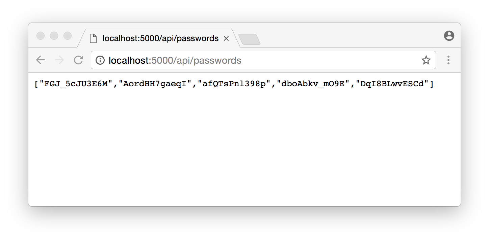

# Random Password Generator

This is a create-react-app demo based on the article [Create React App with Express in Production](https://daveceddia.com/create-react-app-express-production/) by Dave Ceddia. We want to use the React App generator to create static pages from our React Pass-Gen App, routed through a Node/Express Server.

The original article went on to deploy the app to Heroku - please refer to the original article about that.


## Create the Express App

Create a directory and cd in to it with your Terminal or Git Bash. You can initialize your app with npm:

```
npm init
```

Now we need to add two packages through npm: our [express router](https://expressjs.com) and a [password generator](https://www.npmjs.com/package/password-generator), that provides a single API endpoint, **/api/passwords**. We use the *--save* to add those dependencies to our package.json file.

```
npm install --save express password-generator
```

Create a file called index.js, which will be the Express app, and type this in:

```js
const express = require('express');
const path = require('path');
const generatePassword = require('password-generator');

const app = express();

// Serve static files from the React app
app.use(express.static(path.join(__dirname, 'client/build')));

// Put all API endpoints under '/api'
app.get('/api/passwords', (req, res) => {
  const count = 5;

  // Generate some passwords
  const passwords = Array.from(Array(count).keys()).map(i =>
    generatePassword(12, false)
  )

  // Return them as json
  res.json(passwords);

  console.log(`Sent ${count} passwords`);
});

// The "catchall" handler: for any request that doesn't
// match one above, send back React's index.html file.
app.get('*', (req, res) => {
  res.sendFile(path.join(__dirname+'/client/build/index.html'));
});

const port = process.env.PORT || 5000;
app.listen(port);

console.log(`Password generator listening on ${port}`);
```

We’re also going to need a “start” script in package.json, to be able to start our app with the **npm start** command. Open package.json and add a scripts section at the bottom. The full file should look something like this:

```
{
  "name": "random-pass-gen",
  "version": "1.0.0",
  "description": "create-react-app demo",
  "main": "index.js",
  "scripts": {
    "test": "echo \"Error: no test specified\" && exit 1"
  },
  "author": "Mike Polinowski",
  "license": "ISC",
  "dependencies": {
    "express": "^4.15.4",
    "password-generator": "^2.1.0"
  },
  "scripts": {
    "start": "node index.js"
  }
}
```

We can test our app with **npm start** and opening the following URL inside our Browser (or CURL): *http://localhost:5000/api/passwords*. The start command starts our Node/Express Server on our localhost with the port defined inside index.js (5000). Calling the API endpoint /api/password gives us access to the password generator.


