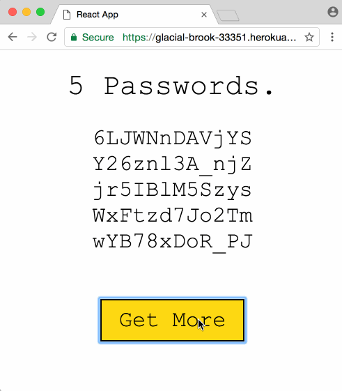

# Random Password Generator

This is a create-react-app demo based on the article [Create React App with Express in Production](https://daveceddia.com/create-react-app-express-production/) by Dave Ceddia. We want to use the React App generator to create static pages from our React Pass-Gen App, routed through a Node/Express Server.

The original article went on to deploy the app to Heroku - please refer to the original article about that.


## Create the Express App

Create a directory and cd in to it with your Terminal or Git Bash. You can initialize your app with npm:

```
npm init
```

Now we need to add two packages through npm: our [express router](https://expressjs.com) and a [password generator](https://www.npmjs.com/package/password-generator), and we will use Express to provides a single API endpoint, **/api/passwords**. We use the *--save* to add those dependencies to our package.json file.

```
npm install --save express password-generator
```

Create a file called index.js, which will be the Express app, and type this in:

```js
const express = require('express');
const path = require('path');
const generatePassword = require('password-generator');

const app = express();

// Serve static files from the React app
app.use(express.static(path.join(__dirname, 'client/build')));

// Put all API endpoints under '/api'
app.get('/api/passwords', (req, res) => {
  const count = 5;

  // Generate some passwords
  const passwords = Array.from(Array(count).keys()).map(i =>
    generatePassword(12, false)
  )

  // Return them as json
  res.json(passwords);

  console.log(`Sent ${count} passwords`);
});

// The "catchall" handler: for any request that doesn't
// match one above, send back React's index.html file.
app.get('*', (req, res) => {
  res.sendFile(path.join(__dirname+'/client/build/index.html'));
});

const port = process.env.PORT || 5000;
app.listen(port);

console.log(`Password generator listening on ${port}`);
```

We’re also going to need a “start” script in package.json, to be able to start our app with the **npm start** command. Open package.json and add a scripts section at the bottom. The full file should look something like this:

```
{
  "name": "random-pass-gen",
  "version": "1.0.0",
  "description": "create-react-app demo",
  "main": "index.js",
  "scripts": {
    "test": "echo \"Error: no test specified\" && exit 1"
  },
  "author": "Mike Polinowski",
  "license": "ISC",
  "dependencies": {
    "express": "^4.15.4",
    "password-generator": "^2.1.0"
  },
  "scripts": {
    "start": "node index.js"
  }
}
```

We can test our app with **npm start** and opening the following URL inside our Browser (or CURL): *http://localhost:5000/api/passwords*. The start command starts our Node/Express Server on our localhost with the port defined inside index.js (5000). Calling the API endpoint /api/password gives us access to the password generator.


## Create the React App

We’re going to use [Create React App](https://github.com/facebookincubator/create-react-app) to generate a project. We will run this React App in our dev environment inside the subfolder */client*. But we will create a static version of our app inside *client/build* (as already defined inside **index.js** of our Express App) once we move to a production environment. This generation of a static version is part of the functionality offered by create-react-app.

If you don’t have Create React App installed yet, do that first:

```
npm install -g create-react-app
```

Generate the React app inside the Express app directory:

```
create-react-app client
```

To test the app, cd in to the */client* directory and run **npm start**. This will run the create-react-app starter app with some boilerplate code on port 3000:


Create React App will proxy API requests from the React app to the Express app if we add a “proxy” key in package.json like this:

```
"proxy": "http://localhost:5000"
```

This goes in client/package.json, not in the Express app’s package.json!


Now we want to replace the boilerplate app with our own - the code is located inside */client/src/app.js*. We will replace it with the following code:

```jsx
import React, { Component } from 'react';
import './App.css';

class App extends Component {
  // Initialize state
  state = { passwords: [] }

  // Fetch passwords after first mount
  componentDidMount() {
    this.getPasswords();
  }

  getPasswords = () => {
    // Get the passwords and store them in state
    fetch('/api/passwords')
      .then(res => res.json())
      .then(passwords => this.setState({ passwords }));
  }

  render() {
    const { passwords } = this.state;

    return (
      <div className="App">
        {/* Render the passwords if we have them */}
        {passwords.length ? (
          <div>
            <h1>5 Passwords.</h1>
            <ul className="passwords">
              {/*
                Generally it's bad to use "index" as a key.
                It's ok for this example because there will always
                be the same number of passwords, and they never
                change positions in the array.
              */}
              {passwords.map((password, index) =>
                <li key={index}>
                  {password}
                </li>
              )}
            </ul>
            <button
              className="more"
              onClick={this.getPasswords}>
              Get More
            </button>
          </div>
        ) : (
          // Render a helpful message otherwise
          <div>
            <h1>No passwords :(</h1>
            <button
              className="more"
              onClick={this.getPasswords}>
              Try Again?
            </button>
          </div>
        )}
      </div>
    );
  }
}

export default App;
```

And while we are add it, just add some styling in */client/src/app.css* to make our app look pretty:

```css
.App {
  text-align: center;
  font-family: "Courier New", monospace;
  width: 100%;
}

h1 {
  font-weight: normal;
  font-size: 42px;
}

.passwords {
  list-style: none;
  padding: 0;
  font-size: 32px;
  margin-bottom: 2em;
}

.more {
  font-size: 32px;
  font-family: "Courier New", monospace;
  border: 2px solid #000;
  background-color: #fff;
  padding: 10px 25px;
}
.more:hover {
  background-color: #FDD836;
}
.more:active {
  background-color: #FFEFA9;
}
```

When you restart your app now (inside the client director), you will see our Password Generator in all it's glory on *localhost:3000*. Stop your app again and run:

```
npm run build
```

Which is a command that was defined by create-react-app (**react-scripts**) inside */client/package.json*. It will create a optimized static version of our app inside */client/build*. This is the folder that we already told our Express App (see index.js in the top-level directory) would contain our static content. So by opening our Express App on port 5000 we will have our Express App serving our React App as static content:

```
 http://localhost:3000
```


